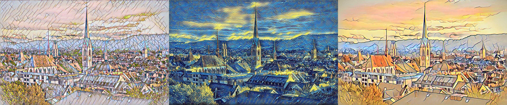

# Fast Neural Style Transfer in PyTorch

<p align="center">
    
</p>

PyTorch implementation of [Fast Neural Style Transfer](https://cs.stanford.edu/people/jcjohns/eccv16/) ([official Lua implementation](https://github.com/jcjohnson/fast-neural-style)).

I have made some trained models available [here](https://drive.google.com/drive/folders/1aRD6zakhcDImN2Y54qAT6f4801iLcCLB?usp=sharing).

## Train

```
python3 train.py  --dataset_path <path-to-dataset> \
                  --style_image <path-to-style-image> \
                  --epochs 1 \
                  --iters 10000 \
                  --batch_size 4 \
                  --image_size 256
```

<p align="center">
    
</p>
<p align="center">
    Figure: Training progress over the first 10,000 batches.
</p>

## Test on Video

```
python3 test_on_video.py  --video_path <path-to-video> \
                          --checkpoint_model <path-to-checkpoint> \
                          --export_type 2 \
                          --max_size 512 \
                          --overlap 32
```

export_type determines how the result is saved. Its possible values are 0, for export frames only, 1 for export video only, and 2 for export both. 2 is recommended as the video export process can go wrong, and manually compressing the frames using ffmpeg command line interface can be useful as more options are available, eg. audio.

<p align="center">
    
</p>

## Test on Image

```
python3 test_on_image.py  --image_path <path-to-image> \
                          --checkpoint_model <path-to-checkpoint> \
                          --max_size 512 \
                          --overlap 32
```

## Tiled images for smaller GPUs

max_size and overlap are optional arguments. If max_size is specified, then the image is split into a number of square tiles. Each tile is processed individually and then the image is stitched back together at the end. Max size is the maximum width of a square image your GPU can process at one time. Find this through experimentation. First try without wither option, and if you get an out of memory error, make the max_size something like 1024 or 512, and keep decreasing it until it works. overlap is the extra number of pixels added onto either side for a smooth transition to the next tile.

--octave_num and --octave_scale are also availiable. A smaller image is processed then scaled up by octave_scale, and then processed again. This is repeated octave_num times until it reaches the original size. This is similar to some DeepDream code. It was a bit of an experiment and it looks terrible, but try it if you want.
