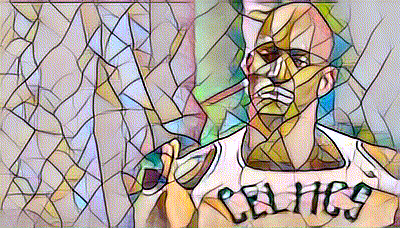

# Fast Neural Style Transfer in PyTorch

PyTorch implementation of Fast Neural Style Transfer.

[[Paper](https://cs.stanford.edu/people/jcjohns/eccv16/)] [[Authors' Lua Implementation](https://github.com/jcjohnson/fast-neural-style)]

## Train

```
python3 train.py  --dataset <path-to-dataset> \
                  --style_image <path-to-style-image> \
                  --epochs 1 \
                  --batch_size 4 \
                  --image_size 256
```

<p align="center">
    
</p>

## Test on Video


 [Trained model](https://drive.google.com/drive/folders/1aRD6zakhcDImN2Y54qAT6f4801iLcCLB?usp=sharing)

```
python3 test_on_video.py  --video_path content-images/celtics.gif \
                          --checkpoint_model model-checkpoints/10000.pth \
```

<p align="center">
    
</p>

## Test on Image

```
python3 test_on_video.py  --image_path <path-to-image> \
                          --checkpoint_model <path-to-checkpoint> \
```
